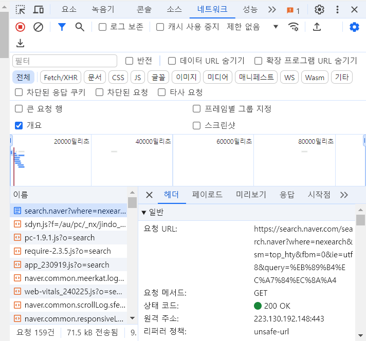
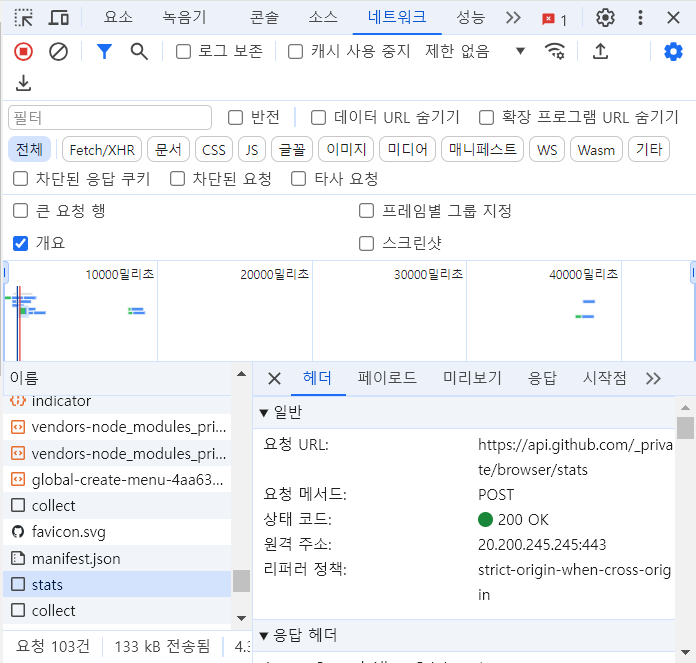

## 수업 정리
JavaScript와 브라우저의 관계
- 싱글 스레드 언어이다 ~~~
    만약 프론트앤드 개발자가 되고 싶다면 매우 중요한 내용! 면접때 질문받는다.

# HTTP
**Hyper Text Transfer Protocol** HTML을 전달할 수 있는 프로토콜
## TCP UDP
### TCP
IP주소는 출발 주소와 도착 주소만 알 수 있음. TCP를 통해 사용자에게 안정적으로 정보를 전달할 수 있음
- 3 way handshake를 통하여 연결 지향적이다
- 데이터 전달을 보증하여, 누락을 알 수 있도록 해준다
- 데이터 전달의 순서를 보장해준다
### UDP
3 way handshake를 생략해서 속도를 향상시킴. (옛날과는 달리 보안문제가 해결되었기 때문)
## HTTP의 특징
### 클라이언트 & 서버 구조
클라이언트가 서버에 요청을 보내고, 응답을 대기함. 그러면 서버서 요청에 대한 결과를 만들어서 응답함
### Stateless(무상태)
서버가 내 정보를 다 갖고 있는 것이 아니라, 내 로컬에서 정보를 가지고 있는 것이다.
### 비연결
클라이언트와 서버의 연결 상태는 짧은 시간만 연결되어 서버 자원을 매우 효율적으로 이용할 수 있다.
**HTTP 지속 연결** 필요한 자원들을 모두 다운받을때까지 연결이 종료되지 않기 때문에 시간을 절약할 수 있음.

*숙제*

## HTTP 개요
**HTTP는 HTML 문서와 같은 리소스들을 가져올 수 있도록 해주는 프로토콜이다.** HTTP는 웹에서 이루어지는 모든 데이터 교환의 기초이며, 클라이언트-서버 프로토콜이기도 하다. 클라이언트-서버 프로토콜이란 (보통 웹브라우저인) 수신자 측에 의해 요청이 초기화되는 프로토콜을 의미한다. 하나의 완전한 문서는 텍스트, 레이아웃 설명, 이미지, 비디오, 스크립트 등 불러온(fetched) 하위 문서들로 재구성된다.

클라이언트와 서버들은 (데이터 스트림과 대조적으로) 개별적인 메시지 교환에 의해 통신한다. 보통 브라우저인 클라이언트에 의해 전송되는 메시지를 요청(request)이라고 부르며, 그에 대해 서버에서 응답으로 전송되는 메시지를 응답(responses)이라고 부른다.

1990년대 초에 설계된 HTTP는 거듭하여 진화해온 확장 가능한 프로토콜이다. HTTP는 애플리케이션 계층의 프로토콜로, 신뢰 가능한 전송 프로토콜이라면 이론상으로는 무엇이든 사용할 수 있으나 TCP 혹은 암호화된 TCP 연결인 TLS를 통해 전송된다.(수업시간에 배운 IP 주소 만으로는 안정적이지 않아 TCP 연결을 이용하는 것 같음)
HTTP의 확장성 덕분에, 오늘날 하이퍼텍스트 문서 뿐만 아니라 이미지와 비디오 혹은 HTML 폼 결과와 같은 내용을 서버로 포스트(POST)하기 위해서도 사용된다. HTTP는 또한 필요할 때마다 웹 페이지를 갱신하기 위해 문서의 일부를 가져오는데 사용될 수도 있다.

# HTTP/1.1, HTTP/2, HTTP/3의 차이점
## HTTP/1.1
1999년에 소개됨.
- 연결당 하나의 요청과 응답을 처리하기 때문에 동시 전송 문제와 다수의 리소스를 처리하기에 속도와 성능 이슈가 존제한다.
    - HOL(Head Of Line) Blocking (특정 응답 지연)
- RTT(Round Trip Time) 증가 (양방향 지연)
    - 헤더가 크다 (특히 쿠키 때문)
    - HTTP/1.1의 헤더에는 많은 메타 정보들이 저장되어 있다.
    - 사용자가 방문한 웹페이지는 다수의 HTTP 요청이 발생하게 되는데 이 경우 매 요청시마다 중복된 헤더 값을 전송하게 되며 각 도메인에 설정된 쿠키 정보도 매 요청시마다 헤더에 포함되어 전송.
### keep-alive
TCP 연결을 재사용할 수 있는 기능이 keep-alive라는 매커니즘.
TCP 연결을 하나의 요청이 아닌 여러 요청에 대해서도 사용을 할 수 있게 되었다. 연결의 지속성은 요청마다 TCP 3-way handshake를 하지 않아도 되기 때문에 요청시간을 대폭 감소시켜 준다.
### HTTP pipelining
*요청/응답 레이턴시 낮춤*
이론적으로 각 클라이언트는 각 response를 기다리기 전에 여러 request를 보낼 수 있다. response는 request 요청 순서와 동일하게 수신되어야 했는데, 이에 대한 구현은 꽤나 까다로워 client와 server 사이에 있는 많은 프록시 서버가 pipelining을 제대로 처리하지 못해 많은 웹 브라우저에서 지양하게 되었다.
### HOL(head of line) blocking (pipelining에서 발생하는 문제점)
pipelining은 HOL blocking으로 고통을 받았다. align blocking 없이 같은 연결에 대한 후속 요청들은 이전 요청이 처리될 때까지 기다려야 했다. 만약 요청이 패킷 손실과 같은 어떠한 이유로 인해 차단이 된다면 같은 연결로 그 뒤에 오는 후속 요청들은 이에 대해 영향을 받을 수 밖에 없었다.

상용할 수 있는 수준의 성능을 유지하기 위해서 브라우저는 일반적으로 하나의 서버에 여러 개의 TCP 연결들을 유지한 채 요청을 병렬로 처리했다.

## HTTP/2
2015년에 소개됨.
TCP 연결에서 같은 서버로 여러 요청 stream을 보낼 수 있는 Multiplexed Streams이 소개됐다. HTTP/1.1의 pipelining과는 달리, 각 stream은 서로에 대해 독립적으로 동작했다. 그래서 요청을 보낼 때 순서를 보장해 줄 필요가 없게 되었고, 이렇게 HTTP/2는 HOL blocking 문제를 애플리케이션 계층에서 해결했다. 그러나 TCP 전송 계층에서는 바이트로 데이터를 처리하기 때문에 TCP HOL 문제까지는 해결하지 못하였다.
    TCP HOL 차단 문제: TCP는 엄격한 순서로 데이터를 처리한다. TCP 스트림에서 패킷이 손실되거나 지연되면 후속 패킷은 해당 후속 패킷이 이미 대상에 도착했더라도 누락된 패킷이 재전송 및 수신될 때까지 기다려야 한다.

### Server Push
HTTP/2는 새로운 데이터를 사용할 수 있을 때 마다 클라이언트가 폴링할 필요없이
서버가 클라이언트에 업데이트를 보낼 수 있도록 하는 푸시 기능을 도입하였다.
즉, 서버가 클라이언트의 요청없이 응답을 보내는 방법으로 클라이언트의 요청을 최소화하여 서버가 리소스를 보내주는 방식.
### Header Compression
HTTP/1.1의 경우 이전 요청과 중복되는 Header도 똑같이 전송하느라 네트워크 자원을 불필요하게 낭비했는데, HTTP/2의 경우에는 헤더의 크기를 줄여 페이지 로드 시간이 감소됨.

## HTTP/3
2020년에 소개된 HTTP/3는 2022년 6월 6일, IETF RFC 9114로 표준화되었다. 이는 전송 계층 프로토콜을 TCP 대신 QUIC이라는 새로운 프로토콜을 사용한다.

### QUIC (Quick UDP Internet Connections)
- 순방향 오류 수정 메커니즘(FEC, Forward Error Correction) 적용
    - 전송한 패킷이 손실되옸다면 수신 측에서 에러를 검출하고 수정하는 방식이며 열악한 네트워크 환경에도 낮은 패킷 손실률을 자랑
- TCP가 아닌 UDP를 선택한 이유
    - TCP 헤더는 신뢰성을 확보하지만 지연을 주리기 힘든 구조
    - UDP는 데이터 전송에 집중한 설계로 별도의 기능이 없음

    따라서, 원하는 기능의 구현이 가능하며, TCP의 레이턴시를 줄이면서 TCP만큼 신뢰성 확보 가능
    
QUIC는 UDP기반이다. 해당 프로토콜에서는 전송 계층에서 stream을 일급 시민으로 취급한다. QUIC stream들은 빠르게 연결된 하나의 통로를 공유한다. 그래서 많은 요청이 발생해도 추가적인 handshake는 필요하지 않는다.

QUIC stream은 독립적이다. 만약 한 stream에서 패킷 손실이 발생한다고 하더라도 대부분의 경우 다른 stream에는 영향을 주지 않는다. 그래서 QUIC은 전송 계층에서 head of line blocking 문제를 겪지 않게 된다.

QUIC는 모바일에서의 많은 인터넷 사용량을 위해 설계되었다. 스마트폰을 들고 다니는 사람들은 하루종일 이동하면서 한 네트워크에서 다른 네트워크로 끊임없이 전환(5G->4G->Wifi->...)한다. TCP를 사용하면 한 네트워크의 연결을 끊고 다른 네트워크로 재연결하는 과정이 오래 걸릴 수 밖에 없다. 그래서 QUIC은 연결이 [IP 주소]와 [네트워크 인터페이스]간에 빠르고 안정적으로 이동할 수 있도록 하는 connection ID라는 개념을 구현하였다.

# HTTP 통신 메소드
## GET

네이버 뉴진스 검색
    주로 데이터를 읽거나 검색할 때 사용되는 메소드이다.
## POST

깃허브 stats
    주로 새로운 리소스를 생성할 때 사용된다.

**온갖곳을 돌아다녔지만 GET과 POST이외에는 찾지 못함....**
## PUT
    리소스를 생성/ 업데이트하기 위해 서버로 데이터를 보내는데 사용된다.
## DELETE
    지정된 리소스를 삭제한다.
## PATCH
    리소스의 부분적인 수정을 할 때에 사용된다.

**POST vs PUT**
    POST와 PUT은 구분해서 사용해야한다. POST는 새로운 데이터를 계속 생성하기 때문에 요청시마다 데이터를 생성하지만, PUT은 사용자가 데이터를 지정하고 수정하는 것이기 때문에 같은 요청을 계속하더라도 데이터가 계속 사용되지는 않는다.

**PUT vs PATCH**
PUT은 지정한 데이터를 전부 수정하는 매소드이지만 PATCH는 정보의 일부분이 변경되는 방법이다. 그래서 PUT은 멱등하지만, PATCH는 멱등하다고 볼 수 없다.